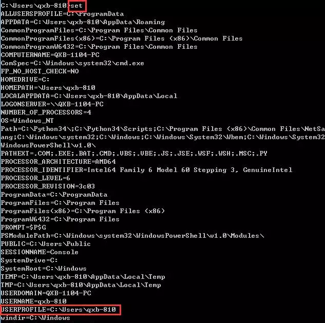
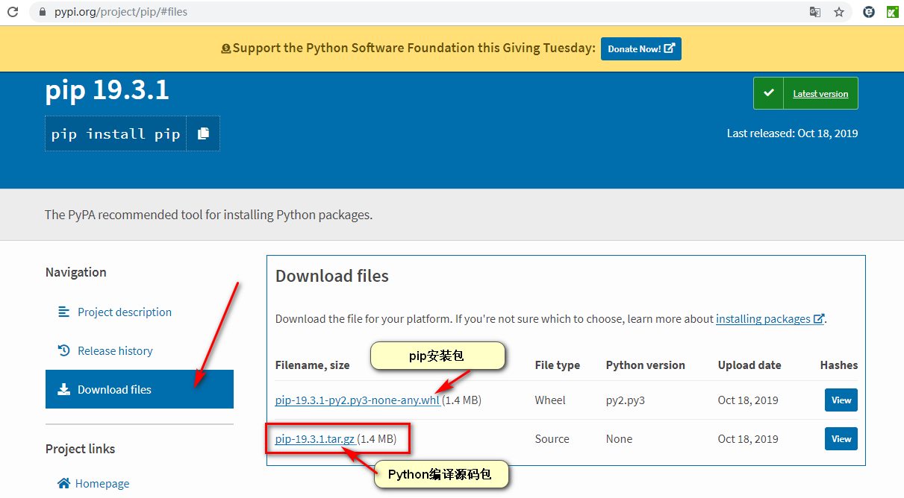

## 使用技巧

#### 1、win10更改pip源

##### a.	cmd下用set命令找到userprofile路径，在该路径下创建pip文件夹和pip.ini



##### b.	pip.ini中写入以下内容：

```
可用：
[global]
index-url = https://mirrors.aliyun.com/pypi/simple/
[install]
trusted-host=mirrors.aliyun.com

未知：
[global]
index-url=https://pypi.tuna.tsinghua.edu.cn/simple 
[install]  
trusted-host=pypi.tuna.tsinghua.edu.cn
disable-pip-version-check = true  
timeout = 6000 
```

##### c.	若是想在安装package的时候再设置源，可以以这种方式来进行：

```
未知：
pip3 install package_name -i https://pypi.tuna.tsinghua.edu.cn/simple

可用国内源：
中国科学技术大学: https://pypi.mirrors.ustc.edu.cn/simple
清华：https://pypi.tuna.tsinghua.edu.cn/simple
豆瓣：http://pypi.douban.com/simple/
```

#### 2、离线安装pip

##### a.	官网下载源码包：https://pypi.python.org/pypi/pip



##### b.	解压后进入目录执行

```cmd
python setup.py install
```

##### c.	验证是否安装好

```cmd
pip3 --version
```

#### 3、离线安装Python模块

官方文档：https://docs.python.org/zh-cn/3.7/installing/index.html

##### a.	在联网机器上将已安装的模块下载好，paklist.txt 放进 pak 目录里

```cmd
pip3 freeze > paklist.txt
pip3 download -r paklist.txt -d pak
```

##### b.	在离线机器上进入pak目录

```cmd
pip3 install --no-index --find-links=file:. -r paklist.txt
```

##### c.	官方的第三方模块仓库：https://pypi.org/

或者到这里搜想要的模块：https://www.lfd.uci.edu/~gohlke/pythonlibs/

#### 4、常用函数

###### eval() -- 给个字符串给eval，eval给你一个表达式返回值。（将字符串转为变量使用）例：

```python
a1=(178)
a2=(179)
a3=(180)
d=[]
i=1
while i<4:
    d.append(eval('a'+str(i)))
    i+=1
print(d)
```

#### 5、坑

pymysql模块定义端口时要为数字类型

cx_oracle模块定义端口时要为字符串类型

pymssql模块定义端口时要为字符串类型